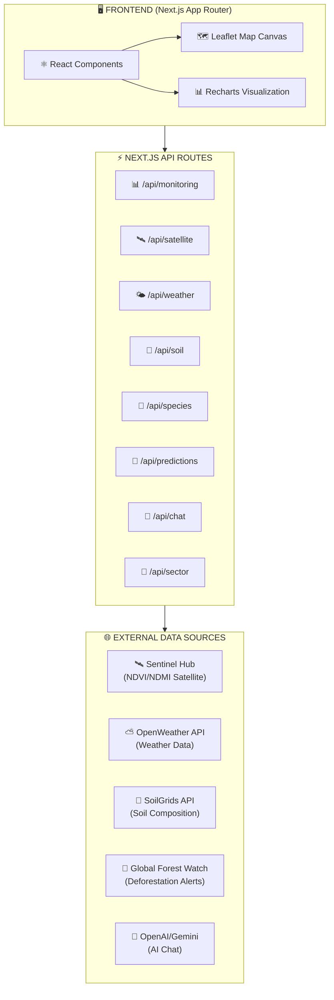
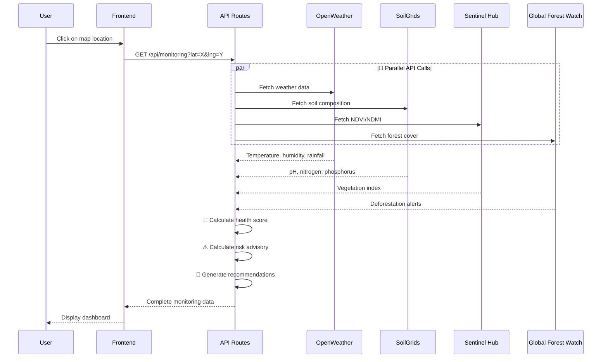

# 🌲 Habitat - Adaptive Reforestation Platform
#  youtube video link https://youtu.be/PVFCDZHA3nM?si=JWHWQqirG2Qh8RtL
<div align="center">


### 🌍 **A GIS-powered intelligent reforestation planning and monitoring platform**

_🏆 Built for TSec Hacks Hackathon_

[🚀 Features](#-key-features) • [🏗️ Architecture](#️-system-architecture) • [📸 Screenshots](#-screenshots--demo) • [🛠️ Setup](#-quick-start)

---

### 🌟 **Transform Deforested Lands into Thriving Ecosystems**

</div>

---

## 📸 Screenshots & Demo

<div align="center">

### 🗺️ **Main Dashboard - Planning Phase**

_Interactive map view with India-centric focus, forest zone overlays, and sector analysis_


> 📍 **What's happening here?**  
> The main dashboard shows an interactive Leaflet map centered on India. Users can click anywhere on the map to analyze that location. The left panel displays the map with forest zone overlays (Western Ghats, Eastern Ghats, Central Highlands shown in different colors). The right panel shows sector analysis controls where users can input coordinates and radius for detailed analysis.

---

### 📊 **Ecosystem Monitoring Dashboard**

_Real-time health metrics, NDVI analysis, and environmental indicators_


> 📈 **What's happening here?**  
> After selecting a location, the monitoring phase displays a comprehensive ecosystem health score (0-100) calculated using a weighted formula. Six key metrics are shown: NDVI (vegetation), Moisture Index, Temperature, Air Quality Index (AQI), Forest Cover %, and Soil pH. Each metric card shows current values with color-coded status indicators and impact warnings when values are outside optimal ranges.

---

### 📉 **Historical Trends & Analysis**

_12-month historical data visualization with trend charts_


> 📊 **What's happening here?**  
> This view shows historical ecosystem data over 12 months using Recharts visualization. The trends chart helps users identify patterns in NDVI, moisture, temperature, and other metrics over time. This historical context is crucial for understanding seasonal variations and detecting long-term degradation or improvement in ecosystem health.

---

### ⚠️ **Risk Advisory & Species Recommendations**

_AI-powered risk assessment with drought/flood predictions and species suggestions_


> 🌡️ **What's happening here?**  
> The Risk Advisory panel analyzes current conditions to predict potential risks (drought, flood, heat wave). Based on the analysis, the system recommends suitable tree species for reforestation with suitability scores. For example, Neem might show 92% suitability for drought-prone areas. The panel also suggests actionable solutions like irrigation methods and soil management techniques.

---

### 🔬 **Calamity Simulation**

_Model the impact of natural disasters on your reforestation plans_


> 🌪️ **What's happening here?**  
> The Simulation phase allows users to model "what-if" scenarios. Select a calamity type (drought, flood, heat wave, frost, or pest outbreak), set severity (0-100%), and duration (weeks). The system simulates the impact on planted species, showing survival rates, recovery time estimates, and mitigation recommendations. This helps planners prepare contingency strategies.

---

### 🤖 **AI Chat Assistant**

_Natural language interface for ecosystem queries and recommendations_


> 💬 **What's happening here?**  
> The AI Chat assistant (powered by OpenAI GPT-4 or Google Gemini) provides a conversational interface. Users can ask questions like "What trees should I plant here?" or "What's the current NDVI for this region?". The AI has tool-calling capabilities to fetch real-time data and provide context-aware, actionable recommendations.

</div>

---

## 📋 Table of Contents

| #   | Section                                          | Description                        |
| --- | ------------------------------------------------ | ---------------------------------- |
| 1   | [🎯 Overview](#-overview)                        | What is Habitat and why it matters |
| 2   | [✨ Key Features](#-key-features)                | All platform capabilities          |
| 3   | [🏗️ System Architecture](#️-system-architecture) | Technical design & data flow       |
| 4   | [🚀 User Journey](#-user-journey-flow)           | Step-by-step usage guide           |
| 5   | [📊 Phase Details](#-phase-breakdown)            | Deep dive into each phase          |
| 6   | [🔌 API Reference](#-api-endpoints)              | All available endpoints            |
| 7   | [🛠️ Tech Stack](#️-tech-stack)                   | Technologies used                  |
| 8   | [⚡ Quick Start](#-quick-start)                  | Get running in minutes             |
| 9   | [🔑 API Keys](#-api-keys-setup)                  | External service configuration     |

---

## 🎯 Overview

**Habitat** is an intelligent, GIS-powered adaptive reforestation platform that helps environmental planners, researchers, and organizations make data-driven decisions for ecosystem restoration in India.

The platform combines **real-time satellite imagery**, **weather data**, **soil analysis**, and **AI-powered recommendations** to provide comprehensive reforestation planning, monitoring, and prediction capabilities.

```
╔═══════════════════════════════════════════════════════════════════════════════╗
║                           🌲 HABITAT PLATFORM 🌲                               ║
╠═══════════════════════════════════════════════════════════════════════════════╣
║                                                                               ║
║   📍 SELECT LOCATION      →     📊 ANALYZE DATA      →     🌱 PLAN & MONITOR  ║
║   ═════════════════           ═══════════════            ════════════════    ║
║   • Click on map              • Satellite imagery        • View health score  ║
║   • Enter coordinates         • Weather data             • Track metrics      ║
║   • Define radius             • Soil composition         • Get AI advice      ║
║                               • Forest cover             • Simulate scenarios ║
║                                                                               ║
╚═══════════════════════════════════════════════════════════════════════════════╝
```

### 💡 Why Habitat?

| Problem                          | Habitat's Solution                |
| -------------------------------- | --------------------------------- |
| 🌍 Unplanned reforestation fails | 📊 Data-driven site selection     |
| 🌡️ No real-time monitoring       | 📡 Live satellite & weather feeds |
| 🌪️ Unprepared for calamities     | 🔬 Simulation & risk prediction   |
| 🤔 Species selection guesswork   | 🤖 AI-powered recommendations     |

---

## ✨ Key Features

### 🗺️ **Phase 1: Planning**

| Feature              | Description                                                 |
| -------------------- | ----------------------------------------------------------- |
| 🗺️ Interactive Map   | India-centric Leaflet map with click-to-analyze             |
| 🟢 Forest Overlays   | GeoJSON layers for Western/Eastern Ghats, Central Highlands |
| 📍 Location Analysis | Instant data fetch for any coordinates                      |
| 🌲 Species Selection | AI-recommended trees based on conditions                    |
| 📌 Site Marking      | Mark and track afforestation sites                          |

### 📊 **Phase 2: Monitoring**

| Feature            | Description                                 |
| ------------------ | ------------------------------------------- |
| 💚 Health Score    | Weighted ecosystem score (0-100)            |
| 📈 6 Key Metrics   | NDVI, Moisture, Temp, AQI, Forest Cover, pH |
| ⚠️ Impact Warnings | Color-coded alerts for out-of-range values  |
| 📉 12-Month Trends | Historical visualization with Recharts      |
| 🚨 Risk Advisory   | Drought/Flood/Heat predictions              |

### 🔬 **Phase 3: Simulation**

| Feature            | Description                                     |
| ------------------ | ----------------------------------------------- |
| 🌪️ Calamity Types  | Drought, Flood, Heat Wave, Frost, Pest Outbreak |
| 📉 Impact Modeling | Species survival rate predictions               |
| ⏱️ Recovery Time   | Estimated recovery periods                      |
| 💡 Mitigation Tips | Actionable recommendations                      |

### 🔮 **Phase 4: Prediction**

| Feature           | Description                            |
| ----------------- | -------------------------------------- |
| 🔮 AI Forecasts   | Machine learning ecosystem predictions |
| 📈 NDVI Trends    | 3-12 month vegetation forecasts        |
| ⚠️ Risk Factors   | Seasonal risk analysis                 |
| 🌳 Carbon Capture | 5-20 year sequestration estimates      |

### 🤖 **AI Assistant**

| Feature             | Description                       |
| ------------------- | --------------------------------- |
| 💬 Natural Language | Chat in plain English/Hindi       |
| 🔧 Tool Calling     | Real-time data fetching           |
| 🎯 Context Aware    | Location-specific recommendations |

---

## 🏗️ System Architecture

### 🔄 High-Level Architecture Diagram



### 🧩 Component Architecture

```
╔═══════════════════════════════════════════════════════════════════════════════════╗
║                        📱 app/page.tsx (Main Dashboard)                            ║
╠═══════════════════════════════════════════════════════════════════════════════════╣
║                                                                                    ║
║  ┌───────────────────────────────────────────────────────────────────────────┐    ║
║  │   🧭 Phase Navigation Bar                                                  │    ║
║  │   [📍 Planning] [📊 Monitoring] [🔬 Simulation] [🔮 Prediction]            │    ║
║  └───────────────────────────────────────────────────────────────────────────┘    ║
║                                                                                    ║
║  ┌─────────────────────────────┐    ┌─────────────────────────────────────┐      ║
║  │      🗺️ Map Canvas          │    │        📋 Side Panel                │      ║
║  │   (Leaflet + GeoJSON)       │    │  ┌────────────────────────────────┐│      ║
║  │                              │    │  │ 💚 HealthGauge                ││      ║
║  │  • India-centric view        │    │  │ (Ecosystem Score 0-100)       ││      ║
║  │  • Forest zone overlays      │    │  └────────────────────────────────┘│      ║
║  │  • Click-to-analyze          │    │  ┌────────────────────────────────┐│      ║
║  │  • Afforestation markers     │    │  │ 📊 MetricCards (6 metrics)    ││      ║
║  │                              │    │  │ NDVI • Moisture • Temp         ││      ║
║  └─────────────────────────────┘    │  │ AQI • Forest Cover • pH        ││      ║
║                                      │  └────────────────────────────────┘│      ║
║                                      │  ┌────────────────────────────────┐│      ║
║                                      │  │ 📈 TrendsChart (12-month)     ││      ║
║                                      │  └────────────────────────────────┘│      ║
║                                      │  ┌────────────────────────────────┐│      ║
║                                      │  │ ⚠️ RiskAdvisory               ││      ║
║                                      │  │ • Drought/Flood/Heat alerts    ││      ║
║                                      │  │ • Species recommendations      ││      ║
║                                      │  │ • Irrigation solutions         ││      ║
║                                      │  └────────────────────────────────┘│      ║
║                                      └─────────────────────────────────────┘      ║
║                                                                                    ║
║  ┌───────────────────────────────────────────────────────────────────────────┐    ║
║  │                          🤖 AI Chat (Collapsible)                          │    ║
║  └───────────────────────────────────────────────────────────────────────────┘    ║
║                                                                                    ║
╚═══════════════════════════════════════════════════════════════════════════════════╝
```

---

## 🚀 User Journey Flow

```mermaid
flowchart LR
    subgraph Start["🏠 START"]
        A[👤 User Opens App]
    end

    subgraph Planning["📍 PLANNING PHASE"]
        B[🗺️ View India Map]
        C[📍 Click Location]
        D[🔍 Analyze Sector]
    end

    subgraph Monitoring["📊 MONITORING PHASE"]
        G[💚 View Health Score]
        H[📈 Check Metrics]
        K[🚨 Risk Advisory]
    end

    subgraph Simulation["🔬 SIMULATION"]
        L[🌪️ Select Calamity]
        N[▶️ Run Simulation]
    end

    subgraph Prediction["🔮 PREDICTION"]
        Q[🔮 AI Forecasts]
        S[📋 Plan Actions]
    end

    A --> B --> C --> D
    D --> G --> H --> K
    K --> L --> N
    N --> Q --> S
```



---

## 🔄 Data Flow

### 📡 Data Flow Sequence



**Health Score Formula:** `NDVI×25% + Moisture×20% + Temp×15% + AQI×10% + Forest×20% + Soil×10%`

---

## 📋 Phase Breakdown

### 📍 Phase 1: Planning

| Feature               | Icon | Description                                                 |
| --------------------- | ---- | ----------------------------------------------------------- |
| **Map View**          | 🗺️   | Interactive Leaflet map centered on India                   |
| **Forest Overlays**   | 🌳   | GeoJSON layers for Western/Eastern Ghats, Central Highlands |
| **Location Analysis** | 📍   | Click-to-analyze with instant data fetch                    |
| **Species Selection** | 🌲   | AI-recommended species based on conditions                  |
| **Site Marking**      | 📌   | Mark and track afforestation sites                          |

### 📊 Phase 2: Monitoring

| Metric              | Weight | Source       | Status Thresholds  |
| ------------------- | ------ | ------------ | ------------------ | ---------- | ---------- |
| 🌿 **NDVI**         | 25%    | Sentinel Hub | 🔴 < 0.3           | 🟡 0.3-0.6 | 🟢 > 0.6   |
| 💧 **Moisture**     | 20%    | Calculated   | 🔴 < 30% / > 80%   | 🟡 30-40%  | 🟢 40-70%  |
| 🌡️ **Temperature**  | 15%    | OpenWeather  | 🔴 < 15°C / > 35°C | 🟡 15-20°C | 🟢 20-30°C |
| 💨 **AQI**          | 10%    | OpenWeather  | 🔴 > 150           | 🟡 100-150 | 🟢 < 100   |
| 🌳 **Forest Cover** | 20%    | GFW          | 🔴 < 20%           | 🟡 20-40%  | 🟢 > 40%   |
| 🌱 **Soil pH**      | 10%    | SoilGrids    | 🔴 < 5.5 / > 8.0   | 🟡 5.5-6.0 | 🟢 6.0-7.5 |

### 🔬 Phase 3: Simulation

| Calamity Type     | Icon | Impact Factors                                 |
| ----------------- | ---- | ---------------------------------------------- |
| **Drought**       | ☀️   | -40% survival, extended recovery, water stress |
| **Flood**         | 🌊   | Root rot risk, soil erosion, nutrient washout  |
| **Heat Wave**     | 🔥   | Leaf scorch, transpiration stress, growth halt |
| **Frost**         | ❄️   | Cell damage, dormancy trigger, tip burn        |
| **Pest Outbreak** | 🐛   | Defoliation, bark damage, disease spread       |

### 🔮 Phase 4: Prediction

| Prediction Type          | Icon | Timeframe   | Methodology                           |
| ------------------------ | ---- | ----------- | ------------------------------------- |
| **NDVI Trend**           | 📈   | 3-12 months | Historical pattern + climate forecast |
| **Risk Factors**         | ⚠️   | Seasonal    | Weather models + historical events    |
| **Carbon Sequestration** | 🌍   | 5-20 years  | Growth models + species factors       |

---

## 🔌 API Endpoints

| Endpoint           | Method | Icon | Description                            |
| ------------------ | ------ | ---- | -------------------------------------- |
| `/api/monitoring`  | GET    | 📊   | Full ecosystem metrics + risk advisory |
| `/api/satellite`   | GET    | 🛰️   | NDVI/NDMI satellite analysis           |
| `/api/weather`     | GET    | 🌤️   | Current weather + forecast             |
| `/api/soil`        | GET    | 🌱   | Soil composition data                  |
| `/api/species`     | GET    | 🌲   | Species recommendations                |
| `/api/predictions` | GET    | 🔮   | AI-powered forecasts                   |
| `/api/sector`      | POST   | 📍   | Comprehensive sector analysis          |
| `/api/simulation`  | POST   | 🔬   | Calamity impact simulation             |
| `/api/chat`        | POST   | 🤖   | AI chat assistant                      |
| `/api/report`      | GET    | 📄   | Generate PDF report                    |

### 📝 Example: Monitoring API Response

```json
{
  "metrics": {
    "health_score": 72.5, // 💚 Overall ecosystem health
    "ndvi_current": 0.65, // 🌿 Vegetation density
    "soil_ph": 6.8, // 🌱 Soil acidity
    "moisture_index": 55, // 💧 Soil moisture %
    "lst_temp": 28.5, // 🌡️ Land surface temp
    "aqi": 45, // 💨 Air quality index
    "forest_cover": 42, // 🌳 Forest percentage
    "carbon_sequestration": 180 // 🌍 Tons CO₂/hectare
  },
  "health_breakdown": {
    "vegetation": { "value": 0.65, "contribution": 16.25, "status": "good" },
    "moisture": { "value": 55, "contribution": 11, "status": "moderate" },
    "temperature": { "value": 28.5, "contribution": 12, "status": "good" },
    "air_quality": { "value": 45, "contribution": 5.5, "status": "excellent" },
    "forest_cover": { "value": 42, "contribution": 8.4, "status": "moderate" },
    "soil_health": { "value": 6.8, "contribution": 9.3, "status": "good" }
  },
  "risk_advisory": {
    "risks": [
      {
        "type": "drought",
        "level": "moderate",
        "probability": 45,
        "description": "..."
      }
    ],
    "recommendedSpecies": [
      {
        "name": "Neem",
        "suitability": 92,
        "reason": "Excellent drought tolerance"
      },
      { "name": "Banyan", "suitability": 88, "reason": "Deep root system" }
    ],
    "solutions": [
      {
        "title": "Install Drip Irrigation",
        "priority": "immediate",
        "category": "irrigation"
      },
      {
        "title": "Add Organic Mulch",
        "priority": "recommended",
        "category": "soil"
      }
    ]
  },
  "history": [
    { "month": "Jan", "ndvi": 0.58, "moisture": 45, "temp": 22 },
    { "month": "Feb", "ndvi": 0.62, "moisture": 48, "temp": 25 }
  ]
}
```

---

## 🛠️ Tech Stack

| Category             | Technology                   | Description                     |
| -------------------- | ---------------------------- | ------------------------------- |
| ⚛️ **Framework**     | Next.js 16                   | React framework with App Router |
| 📝 **Language**      | TypeScript                   | Type-safe JavaScript            |
| 🎨 **Frontend**      | React 19 + Tailwind CSS      | Modern UI development           |
| 🧩 **UI Components** | shadcn/ui + Radix UI         | Accessible component library    |
| 🗺️ **Mapping**       | Leaflet.js + React-Leaflet   | Interactive maps                |
| 📊 **Charts**        | Recharts                     | Data visualization              |
| 🤖 **AI**            | OpenAI GPT-4 / Google Gemini | Intelligent recommendations     |
| 🛰️ **Satellite**     | Sentinel Hub API             | NDVI/NDMI imagery               |
| 🌤️ **Weather**       | OpenWeather API              | Real-time weather data          |
| 🌱 **Soil Data**     | SoilGrids API                | Soil composition analysis       |
| 🌳 **Forest Data**   | Global Forest Watch API      | Deforestation monitoring        |

---

## ⚡ Quick Start

### 📋 Prerequisites

| Requirement           | Version   | Check Command    |
| --------------------- | --------- | ---------------- |
| 📦 Node.js            | 18+       | `node --version` |
| 📦 pnpm (recommended) | Latest    | `pnpm --version` |
| 🔑 API Keys           | See below | -                |

### 🚀 Installation Steps

```bash
# 1️⃣ Clone repository
git clone https://github.com/vikasp07/hack-i.git
cd hack-i

# 2️⃣ Install dependencies
pnpm install

# 3️⃣ Configure environment
cp .env.example .env
# 📝 Edit .env with your API keys (see below)

# 4️⃣ Run development server
pnpm dev
```

### 🌐 Open in Browser

```
http://localhost:3000
```

### 🏗️ Production Build

```bash
# Build for production
pnpm build

# Start production server
pnpm start
```

---

## 🔑 API Keys Setup

### 📋 Required Services

| Service                    | Purpose               | Required           | Get Key                                                     |
| -------------------------- | --------------------- | ------------------ | ----------------------------------------------------------- |
| 🛰️ **Sentinel Hub**        | Satellite NDVI/NDMI   | ✅ Yes             | [sentinel-hub.com](https://www.sentinel-hub.com/)           |
| 🌤️ **OpenWeather**         | Weather data          | ✅ Yes             | [openweathermap.org](https://openweathermap.org/api)        |
| 🤖 **OpenAI**              | AI chat               | ✅ Yes (or Gemini) | [platform.openai.com](https://platform.openai.com/)         |
| 🤖 **Google AI**           | AI chat (alternative) | ⚪ Optional        | [ai.google.dev](https://ai.google.dev/)                     |
| 🌳 **Global Forest Watch** | Forest data           | ⚪ Optional        | [globalforestwatch.org](https://www.globalforestwatch.org/) |

### 📝 Environment Variables

Create a `.env` file in the root directory:

```env
# ═══════════════════════════════════════════════════════════════════════════
#                           🔑 REQUIRED API KEYS
# ═══════════════════════════════════════════════════════════════════════════

# 🛰️ Sentinel Hub - Satellite Imagery
SENTINELHUB_CLIENT_ID=your_client_id_here
SENTINELHUB_CLIENT_SECRET=your_client_secret_here

# 🌤️ OpenWeather - Weather Data
OPENWEATHER_API_KEY=your_openweather_api_key_here

# 🤖 OpenAI - AI Chat (GPT-4)
OPENAI_API_KEY=your_openai_api_key_here

# ═══════════════════════════════════════════════════════════════════════════
#                           ⚪ OPTIONAL API KEYS
# ═══════════════════════════════════════════════════════════════════════════

# 🤖 Google Gemini - Alternative AI Provider
GOOGLE_AI_API_KEY=your_gemini_api_key_here

# 🌳 Global Forest Watch - Forest Data
GFW_API_KEY=your_gfw_api_key_here

# ⚙️ Configuration
AI_PROVIDER=openai  # Options: "openai" or "gemini"
```

---

## 🧮 Health Score Calculation

```
╔═══════════════════════════════════════════════════════════════════════════════════╗
║                      🧮 ECOSYSTEM HEALTH SCORE FORMULA                             ║
╠═══════════════════════════════════════════════════════════════════════════════════╣
║                                                                                    ║
║   💚 Health Score = (🌿 NDVI × 25%) + (💧 Moisture × 20%) + (🌡️ Temp × 15%)       ║
║                   + (💨 AQI × 10%) + (🌳 Forest × 20%) + (🌱 Soil × 10%)          ║
║                                                                                    ║
╠═══════════════════════════════════════════════════════════════════════════════════╣
║                                                                                    ║
║   INDICATOR          WEIGHT    OPTIMAL RANGE         CALCULATION                  ║
║   ─────────          ──────    ─────────────         ───────────                  ║
║   🌿 NDVI            25%       0.6 - 0.8             Normalized 0-100             ║
║   💧 Moisture        20%       40% - 70%             Normalized 0-100             ║
║   🌡️ Temperature     15%       20°C - 30°C           Inverse distance             ║
║   💨 AQI             10%       0 - 50                Inverse (100 - norm)         ║
║   🌳 Forest Cover    20%       > 30%                 Direct percentage            ║
║   🌱 Soil pH         10%       6.0 - 7.5             Distance from optimal        ║
║                                                                                    ║
╚═══════════════════════════════════════════════════════════════════════════════════╝
```

### 💚 Score Interpretation

| Score Range | Status       | Color | Meaning                                            |
| ----------- | ------------ | ----- | -------------------------------------------------- |
| **70-100**  | 🟢 Excellent | Green | Healthy ecosystem, minimal intervention needed     |
| **40-69**   | 🟡 Moderate  | Amber | Some concerns, monitoring recommended              |
| **0-39**    | 🔴 Critical  | Red   | Urgent attention required, immediate action needed |

---

## 📁 Project Structure

```
🌲 Habitat_tsechacks/
├── 📱 app/                          # Next.js App Router
│   ├── 🏠 page.tsx                  # Main dashboard
│   ├── 🎨 globals.css               # Global styles
│   ├── 📄 layout.tsx                # Root layout
│   └── 📡 api/                      # API routes
│       ├── 📊 monitoring/           # Ecosystem monitoring
│       ├── 🛰️ satellite/           # Satellite data
│       ├── 🌤️ weather/             # Weather API
│       ├── 🌱 soil/                 # Soil analysis
│       ├── 🌲 species/              # Species recommendations
│       ├── 🔮 predictions/          # AI predictions
│       ├── 🔬 simulation/           # Calamity simulation
│       └── 🤖 chat/                 # AI chat
│
├── 🧩 components/                   # React components
│   ├── 🌲 habitat/                  # Domain-specific
│   │   ├── 💚 health-gauge.tsx      # Ecosystem score
│   │   ├── 📊 metric-card.tsx       # Metric display
│   │   ├── 🗺️ map-canvas.tsx       # Leaflet map
│   │   ├── 📈 trends-chart.tsx      # Historical data
│   │   ├── ⚠️ risk-advisory.tsx    # Risk warnings
│   │   ├── 🌲 species-list.tsx      # Species grid
│   │   ├── 🔬 calamity-simulator.tsx # Simulation panel
│   │   ├── 🔮 prediction-panel.tsx  # AI forecasts
│   │   └── 🤖 ai-chat.tsx           # Chat interface
│   └── 🎨 ui/                       # shadcn/ui components
│
├── 📚 lib/                          # Utility functions
│   ├── 📡 api.ts                    # API client
│   ├── 📍 gis-tools.ts              # GIS utilities
│   └── 📋 types.ts                  # TypeScript types
│
├── 📸 Images/                       # Screenshots
└── 📖 README.md                     # This file!
```

---

## 🤝 Contributing

We welcome contributions! Please follow these steps:

1. 🍴 Fork the repository
2. 🌿 Create a feature branch (`git checkout -b feature/amazing-feature`)
3. 💾 Commit your changes (`git commit -m 'Add amazing feature'`)
4. 📤 Push to the branch (`git push origin feature/amazing-feature`)
5. 🔃 Open a Pull Request

---

## 📜 License

MIT License - see [LICENSE](LICENSE) for details.

---

## 👥 Team

<div align="center">

Built with ❤️ for **🏆 TSec Hacks Hackathon**

### 🌲 **Making the world greener, one data point at a time.** 🌲

---

| 🌟  | Feature           | Status   |
| --- | ----------------- | -------- |
| ✅  | Planning Phase    | Complete |
| ✅  | Monitoring Phase  | Complete |
| ✅  | Simulation Phase  | Complete |
| ✅  | Prediction Phase  | Complete |
| ✅  | AI Chat Assistant | Complete |

---

**[⬆️ Back to Top](#-habitat---adaptive-reforestation-platform)**

</div>
